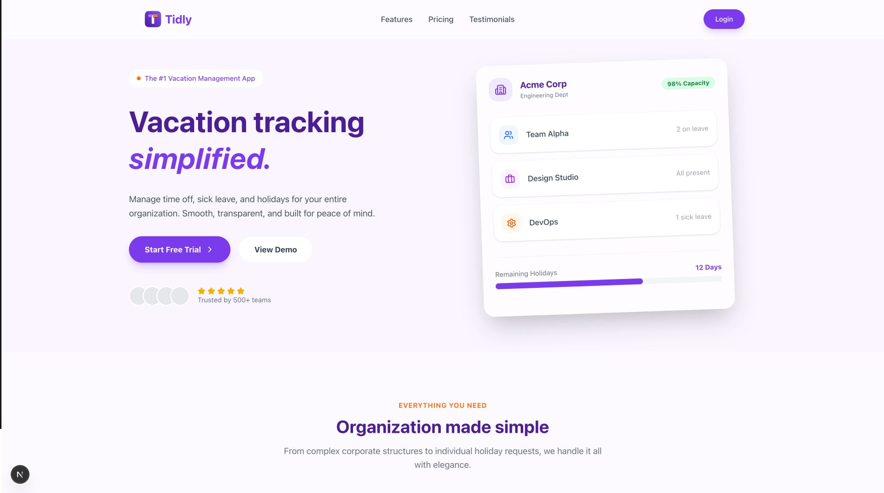

# 📄 Tidly: SaaS Absence Management (Norway MVP)


## 1. Project Objective

To create a robust and scalable SaaS solution to automate absence management (vacations, sick leave, and leaves of absence) for companies in Norway. The focus is on replacing manual processes with a digital workflow that ensures compliance with the *Arbeidsmiljøloven* (Working Environment Act).

---

## 2. Core Modules

### 🏗️ Module 1: Organizational Structure (Multi-tenant)

Manages company hierarchy and ensures data isolation between clients.

* **Company Management**: Registration of companies with unique tax IDs.
* **Department & Team Hierarchy**: Tree structure to define business units.
* **Employee Records**: Management of employees linked to teams and managers.

### ⚙️ Module 2: Absence Configuration (Rules Engine)

Defines how absences are processed and accounted for.

* **Absence Types**: Configuration of *Ferie* (Vacation), *Egenmelding* (Self-declaration), and *Sykmelding* (Sick notes).
* **Accrual & Balances**: Calculation engine for annual vacation balance (typically 25 days in Norway).
* **National Calendar**: Integration of Norwegian public holidays for working day calculation.

### 🔄 Module 3: Requests & Approval Workflow

The operational engine connecting employees to managers.

* **Absence Request**: Interface for employees to request dates, with automatic balance validation.
* **Status Flow**: Lifecycle: `PENDING` -> `AUTHORIZED` (Team Leader) -> `APPROVED` (Manager).

---

## 3. Technology Stack

### Backend (Java 21 / Spring Boot 4)

* **JDK 21**: Virtual Threads for API throughput.
* **Persistence**: PostgreSQL with native UUIDs.
* **Security**: Spring Security with multi-tenancy.

### Frontend (Next.js 16)

* **App Router**: Efficient rendering and SEO-friendly.
* **UI/UX**: Accessible interface focused on speed.
* **Styling**: Tailwind CSS + Shadcn/UI.
* **Auth**: Clerk

---

## 4. Project Structure

The project follows a feature-based structure within the Next.js App Router:

```text
src/
├── app/
│   ├── (auth)/                  # Authentication routes (login, register)
│   ├── (panel)/                 # Protected application area
│   │   ├── _components/         # Shared panel components (Sidebar, etc.)
│   │   ├── dashboard/           # Main dashboard
│   │   ├── home/                # User welcome page
│   │   ├── organization/        # Module 1: Org Structure
│   │   │   ├── company/
│   │   │   ├── department/
│   │   │   ├── team/
│   │   │   └── employee/
│   │   ├── configuration/       # Module 2: Rules & Settings
│   │   │   ├── absence-policies/
│   │   │   ├── absence-type/
│   │   │   └── holiday/
│   │   └── workflow/            # Module 3: Requests & Approvals
│   │       ├── request/
│   │       └── approval/
│   └── (public)/                # Public facing pages (Landing)
├── components/
│   ├── ui/                      # Reusable UI components (buttons, inputs)
│   └── magicui/                 # Animated UI components
├── lib/                         # Utilities and helpers
└── hooks/                       # Custom React hooks
```

## 5. Screenshots



---

## 6. Getting Started

First, run the development server:

```bash
npm run dev
# or
yarn dev
# or
pnpm dev
# or
bun dev
```

Open [http://localhost:3000](http://localhost:3000) with your browser to see the result.

## 7. Learn More

To learn more about the technologies used:

* [Next.js Documentation](https://nextjs.org/docs)
* [Spring Boot Documentation](https://spring.io/projects/spring-boot)
* [Arbeidsmiljøloven](https://lovdata.no/dokument/NL/lov/2005-06-17-62) (Norwegian Working Environment Act)
